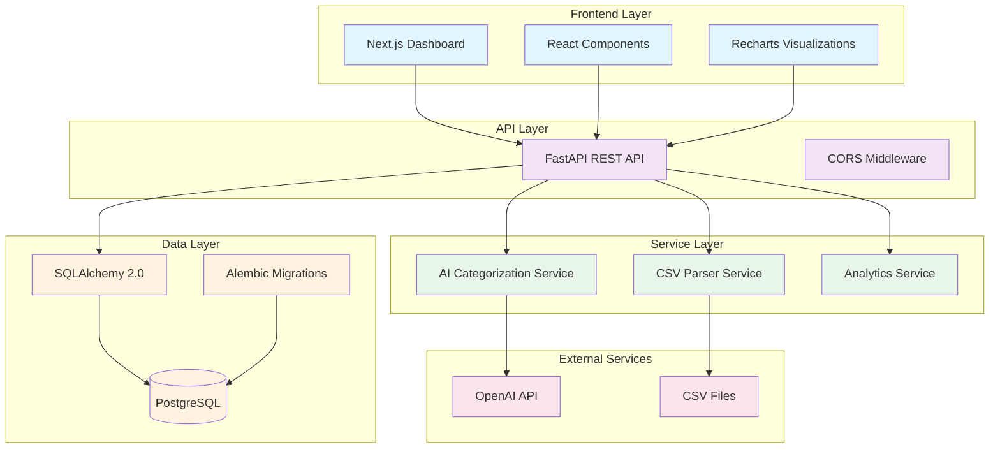
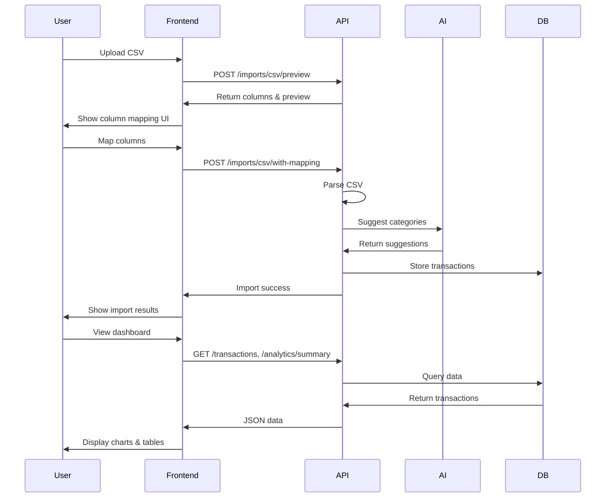
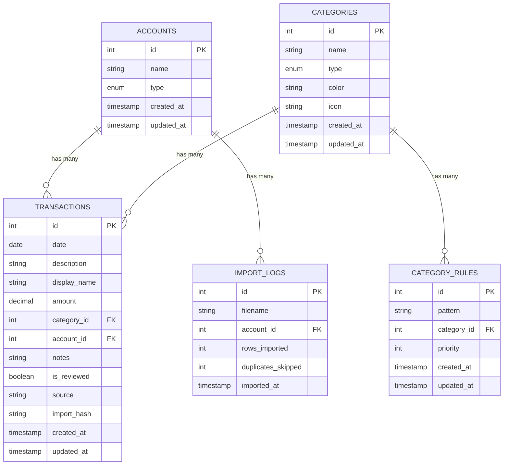

# Spending Tracker Architecture

## System Overview

The Spending Tracker is a full-stack personal finance application with AI-powered categorization, built with FastAPI backend and Next.js frontend.

## Architecture Diagram



## Component Architecture

```mermaid
graph LR
    subgraph "Frontend Components"
        Dashboard[Dashboard Page]
        TransTable[Transaction Table]
        CategoryMgr[Category Manager]
        AccountMgr[Account Manager]
        CSVUpload[CSV Upload]
        Charts[Analytics Charts]
        ReviewPanel[Category Review Panel]
    end
    
    subgraph "Backend Modules"
        AuthRouter[/auth]
        TransRouter[/transactions]
        CatRouter[/categories]
        AccRouter[/accounts]
        ImportRouter[/imports]
        AnalyticsRouter[/analytics]
    end
    
    Dashboard --> TransTable
    Dashboard --> CSVUpload
    Dashboard --> Charts
    Dashboard --> ReviewPanel
    
    TransTable --> TransRouter
    CategoryMgr --> CatRouter
    AccountMgr --> AccRouter
    CSVUpload --> ImportRouter
    Charts --> AnalyticsRouter
    ReviewPanel --> TransRouter
    
    classDef component fill:#e3f2fd
    classDef module fill:#f1f8e9
    
    class Dashboard,TransTable,CategoryMgr,AccountMgr,CSVUpload,Charts,ReviewPanel component
    class AuthRouter,TransRouter,CatRouter,AccRouter,ImportRouter,AnalyticsRouter module
```

## Data Flow



## Database Schema



## Technology Stack

### Frontend
- **Framework**: Next.js 14 with React 18
- **Styling**: TailwindCSS + shadcn/ui components
- **Charts**: Recharts
- **TypeScript**: Full type safety
- **State Management**: React hooks

### Backend
- **Framework**: FastAPI with Python 3.11+
- **ORM**: SQLAlchemy 2.0
- **Migrations**: Alembic
- **Validation**: Pydantic
- **AI Integration**: OpenAI API (gpt-4o-mini)

### Database
- **Primary**: PostgreSQL
- **Connection**: psycopg v3
- **Docker**: Containerized development environment

### Infrastructure
- **API Documentation**: Auto-generated OpenAPI/Swagger
- **CORS**: Configured for frontend
- **File Upload**: Multipart form data
- **Error Handling**: Comprehensive error responses

## Key Features

1. **CSV Import with Column Mapping**
   - Auto-detect column mappings
   - Preview before import
   - Flexible mapping interface

2. **AI-Powered Categorization**
   - OpenAI integration
   - Bulk review and apply
   - Learning from user corrections

3. **Interactive Dashboard**
   - Real-time charts
   - Inline editing
   - Responsive design

4. **Data Management**
   - Category CRUD operations
   - Account management
   - Transaction history

## Security Considerations

- CORS configured for frontend origin
- Input validation on all endpoints
- SQL injection prevention via ORM
- File upload restrictions (CSV only)
- Environment-based configuration
