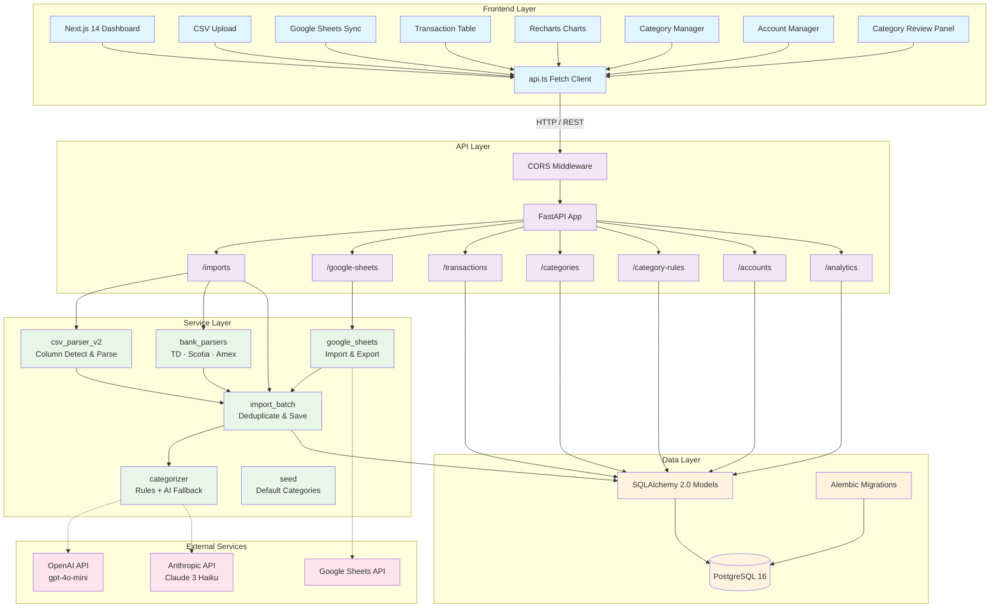
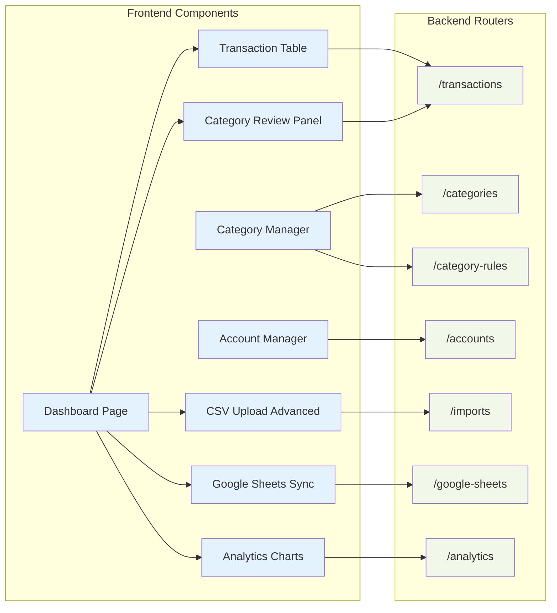
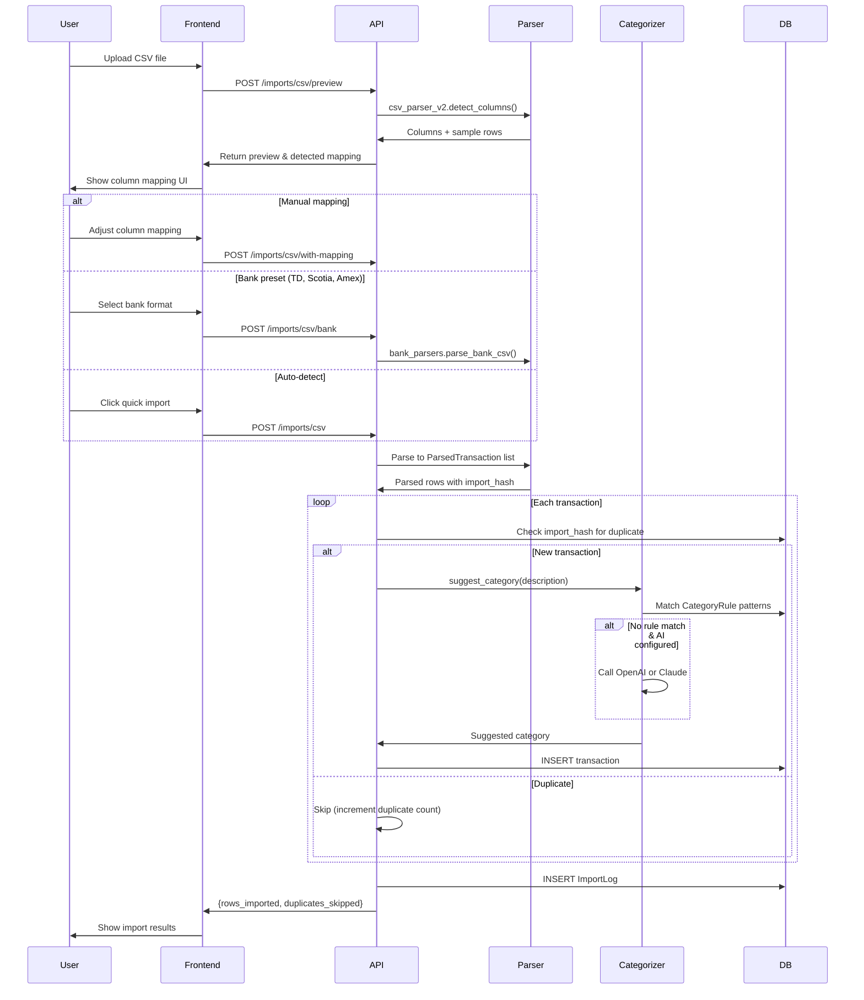
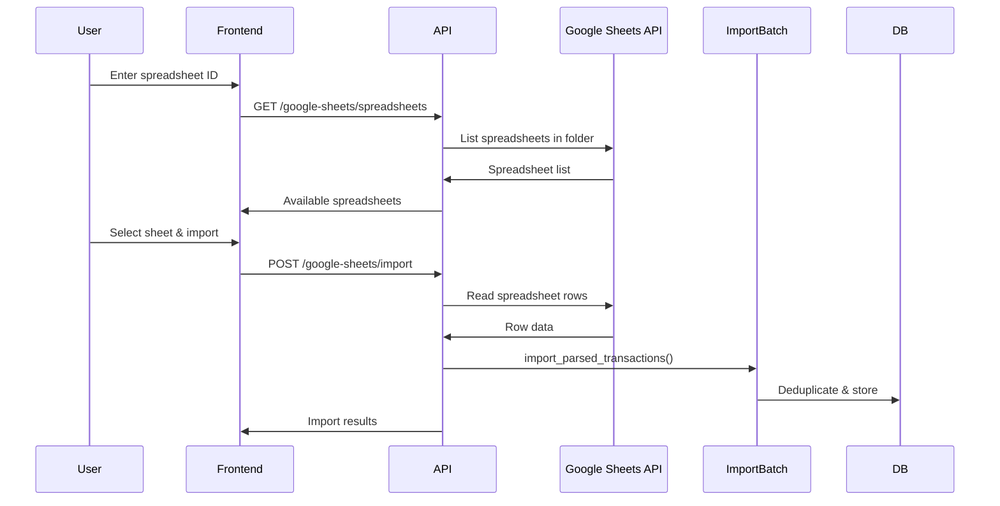
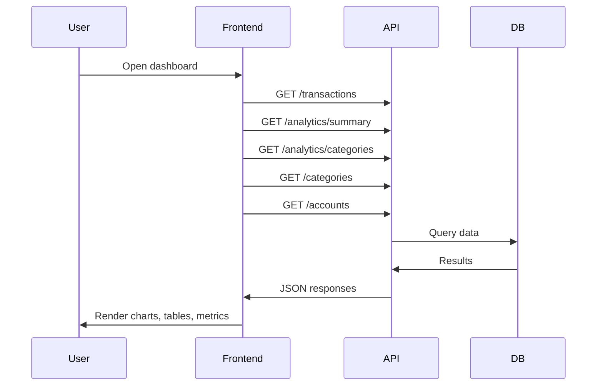
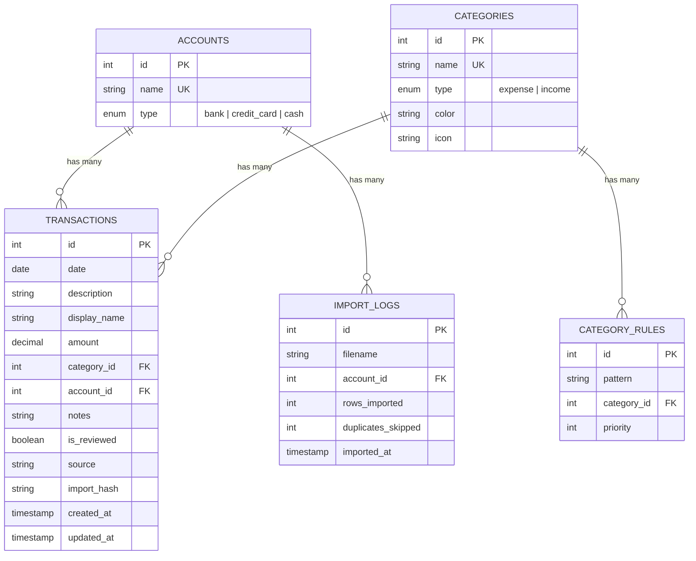
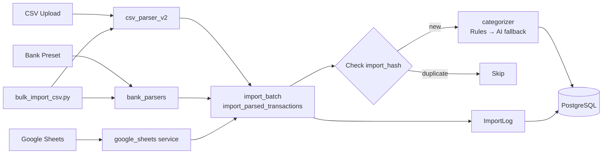

# Spending Tracker Architecture

## System Overview

The Spending Tracker is a full-stack personal finance application with AI-powered categorization, built with a FastAPI backend, Next.js 14 frontend, and PostgreSQL database. It supports CSV import (generic and bank-specific), Google Sheets import/export, and optional AI categorization via OpenAI or Claude.

## Architecture Diagram

## Component Architecture

## Data Flow

### CSV Import

### Google Sheets Import

### Dashboard View

## Database Schema

## Import Pipeline

All import paths (CSV upload, bank presets, Google Sheets, bulk CLI script) converge on a single shared pipeline:

## Technology Stack

### Frontend
- **Framework**: Next.js 14 with React 18 (App Router)
- **Styling**: TailwindCSS + shadcn/ui components
- **Charts**: Recharts
- **Language**: TypeScript
- **State Management**: React hooks (useState, useEffect, useMemo)

### Backend
- **Framework**: FastAPI (Python 3.11+)
- **ORM**: SQLAlchemy 2.0 (sync engine)
- **Migrations**: Alembic
- **Validation**: Pydantic v2
- **CSV Processing**: Pandas
- **AI Integration**: OpenAI API (gpt-4o-mini) or Anthropic Claude (claude-3-haiku)

### Database
- **Primary**: PostgreSQL 16
- **Driver**: psycopg v3 (`postgresql+psycopg://`)
- **Containerized**: Docker with named volume for persistence

### Infrastructure
- **Orchestration**: Docker Compose (Postgres + backend + frontend)
- **API Documentation**: Auto-generated OpenAPI/Swagger at `/docs`
- **CORS**: Configured for frontend origins
- **Ports**: Backend `:8000`, Frontend `:3001` (Docker) / `:3000` (local dev), Postgres `:5433` (host) / `:5432` (internal)

## Key Features

1. **Flexible CSV Import**
   - Auto-detect column mappings
   - Manual column mapping with preview
   - Bank-specific presets (TD Visa, Scotia Visa, Scotia Bank, Amex)
   - Bulk CLI import for historical data (`backend/scripts/bulk_import_csv.py`)

2. **Google Sheets Integration**
   - Import transactions from Google Sheets
   - Export transactions to Google Sheets
   - Browse spreadsheets in a configured Drive folder

3. **AI-Powered Categorization**
   - Rule-based matching first (regex/substring patterns via CategoryRule)
   - AI fallback via OpenAI or Claude (configurable via `AI_PROVIDER`)
   - Bulk review and apply workflow

4. **Interactive Dashboard**
   - Monthly income/expense trend charts
   - Category breakdown visualization
   - Inline transaction editing
   - Responsive design

5. **Data Management**
   - Category CRUD with colors and icons
   - Account management (bank, credit card, cash)
   - Category rules with priority ordering
   - Import deduplication via SHA-256 hash

## Security Considerations

- CORS restricted to configured frontend origins
- Input validation on all endpoints via Pydantic
- SQL injection prevention via SQLAlchemy ORM
- File upload restrictions (CSV only, server-side validation)
- Environment-based configuration (secrets via `.env`, never committed)
- Single-user design; see `docs/authentication.md` for multi-user guidance
